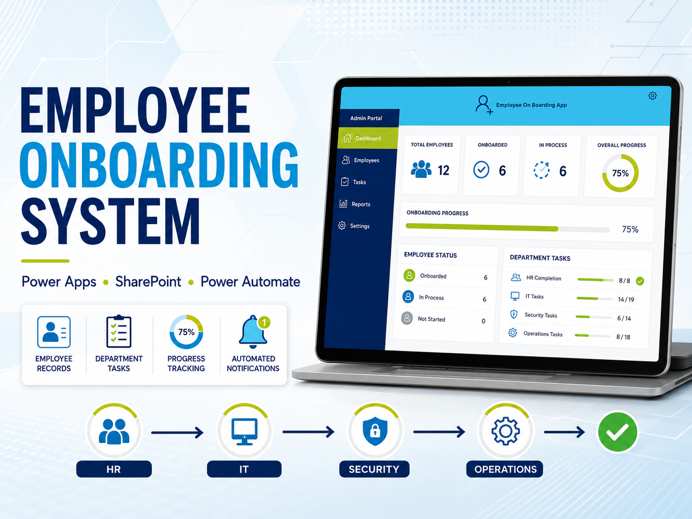
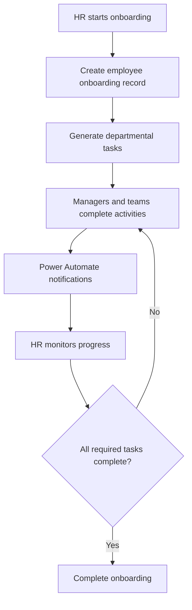
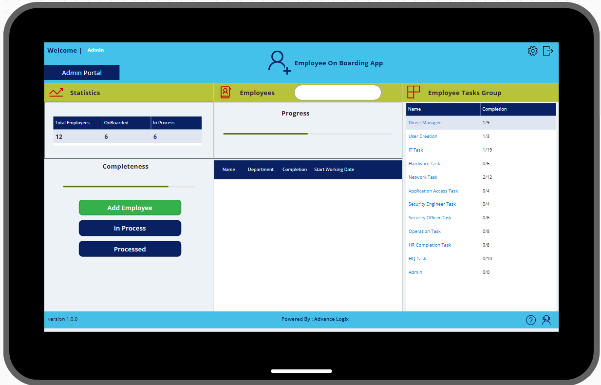
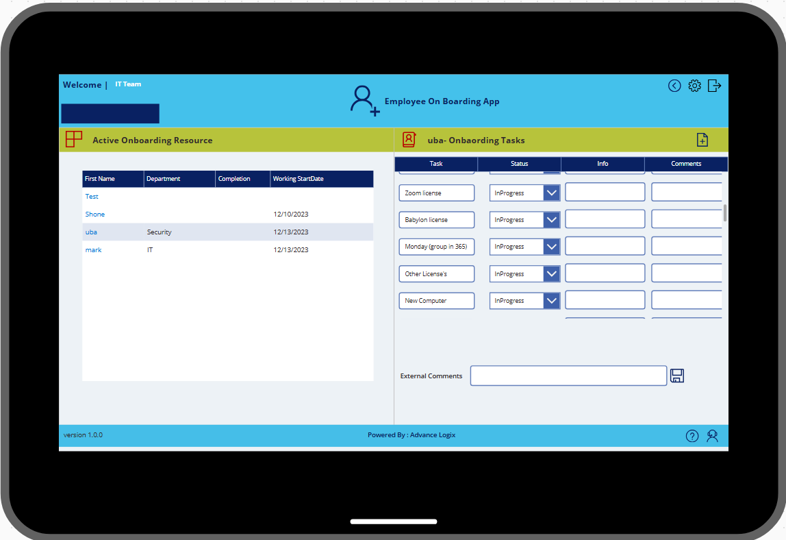
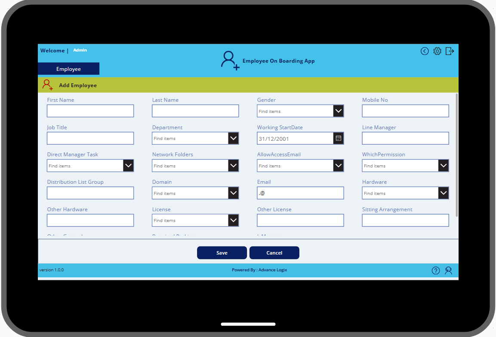

# Employee Onboarding Power App

<p align="center">
  
</p>

A Microsoft Power Platform solution that coordinates employee onboarding across HR, management, IT, security, operations and administrative teams through one structured and traceable workspace.

> **Portfolio notice:** This is a sanitized technical case study. Client names, tenant details, employee data, credentials and proprietary production configuration have been excluded.

## Business Challenge

Employee onboarding often depends on disconnected emails, spreadsheets and verbal follow-ups. Tasks such as account creation, hardware allocation, network access, security clearance and operational preparation can be delayed because ownership and status are not visible centrally.

## Solution Overview

The Power App provides a role-aware onboarding workspace backed by SharePoint. Each department can view and update its assigned activities, while HR and authorized managers can monitor overall progress, outstanding work and onboarding completion. Power Automate supports notifications and background processing.



## Participating Functions

- Human Resources
- Direct Manager
- User and account creation
- IT and hardware
- Network and application access
- Security engineering or security officer
- Operations
- Headquarters and administration

The exact departments and task templates are configurable for each organization.

## Key Capabilities

- Centralized employee onboarding records
- Department-specific task assignment
- Standard and custom onboarding activities
- Role-aware screens and controlled access
- Task ownership, status and completion tracking
- Overall onboarding progress visibility
- Automated reminders and status notifications
- SharePoint-based data management
- Search, filtering and operational dashboards
- Extensible structure for approvals and document collection

## Technology Stack

- Microsoft Power Apps Canvas App
- SharePoint Online / Microsoft Lists
- Microsoft Power Automate
- Microsoft 365 Users and Outlook connectors
- Microsoft Teams integration options

<!-- ## Solution Screenshots


### Onboarding Dashboard


### Department Task View


### Employee Info Update


-->
## Repository Structure

```text
.
├── README.md
├── NOTICE.md
├── docs/
│   ├── architecture.md
│   ├── business-process.md
│   ├── deployment-guide.md
│   └── security-and-governance.md
├── samples/
│   ├── onboarding-data-model.md
│   └── task-template.md
└── assets/
    └── README.md
```

## Business Benefits

- Creates clear ownership across departments
- Reduces manual follow-up by HR
- Improves onboarding consistency and accountability
- Gives management real-time progress visibility
- Provides a structured and auditable process
- Supports faster preparation for a new employee's first day

## Customization Options

The solution can be extended with Dataverse, digital signatures, approvals, document generation, asset inventory, Entra ID provisioning, Microsoft Graph, training assignments, Power BI reporting or offboarding workflows.

## Documentation

- [Solution architecture](docs/architecture.md)
- [Business process](docs/business-process.md)
- [Deployment guide](docs/deployment-guide.md)
- [Security and governance](docs/security-and-governance.md)
- [Sample data model](samples/onboarding-data-model.md)
- [Sample task template](samples/task-template.md)

## Implementation Note

Production implementation must be configured for the target tenant, organizational structure, onboarding policy, roles, permissions, licensing, task templates and governance requirements.

