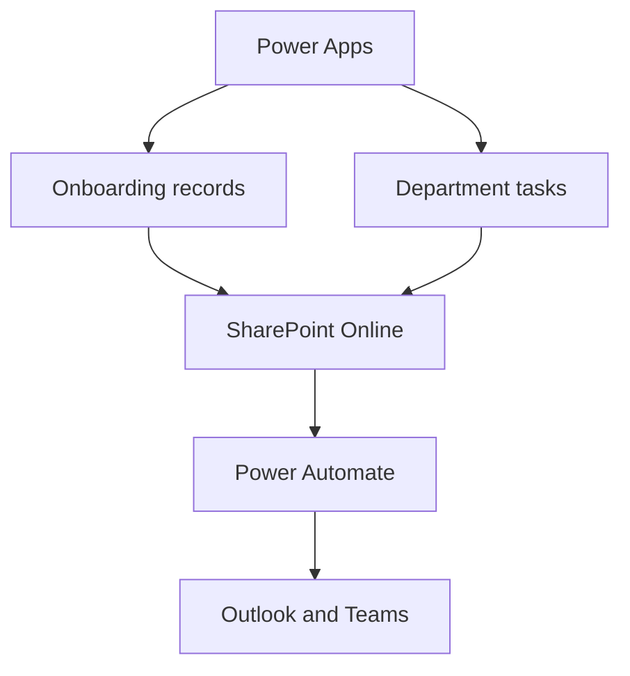

# Solution Architecture

| Component | Responsibility |
|---|---|
| Power Apps Canvas App | Provides role-aware onboarding screens and task interactions |
| SharePoint onboarding list | Stores employee onboarding records and lifecycle status |
| SharePoint task list | Stores department tasks, ownership and completion status |
| Configuration lists | Store departments, task templates and controlled values |
| Power Automate | Creates tasks, sends notifications and performs background processing |
| Microsoft 365 connectors | Resolve users and deliver Outlook or Teams messages |

## Design Considerations

- Separate onboarding headers from departmental task records.
- Use configuration-driven task templates instead of hardcoding activities in screens.
- Apply role checks in both the interface and underlying data permissions.
- Avoid relying only on hidden controls for security.
- Use indexed SharePoint columns and delegable queries where required.
- Keep employee identity, status and task history traceable.

